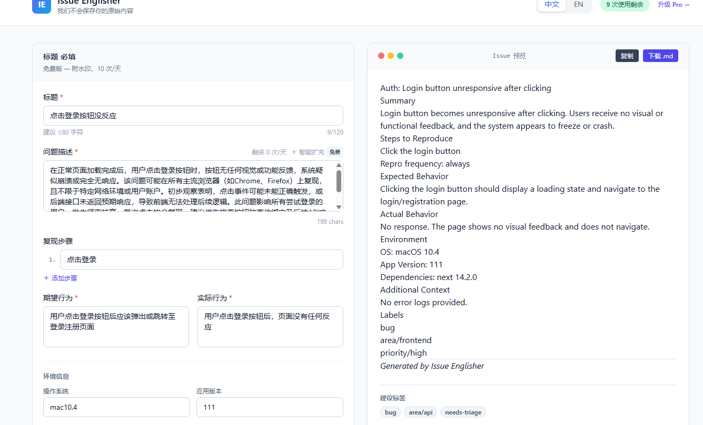
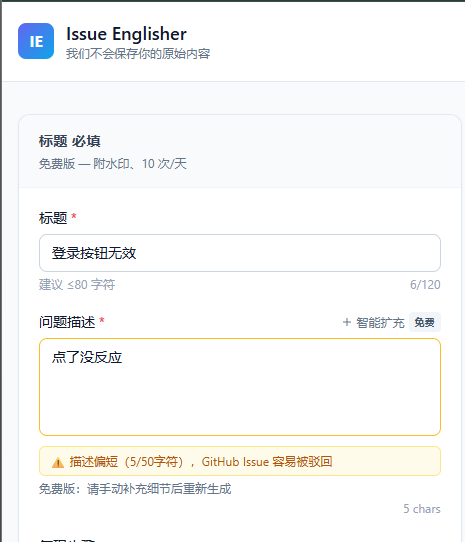
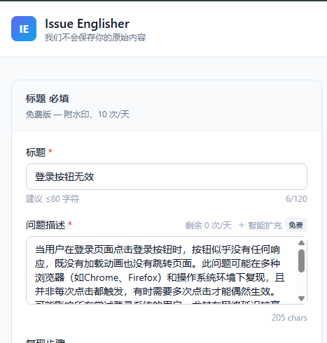
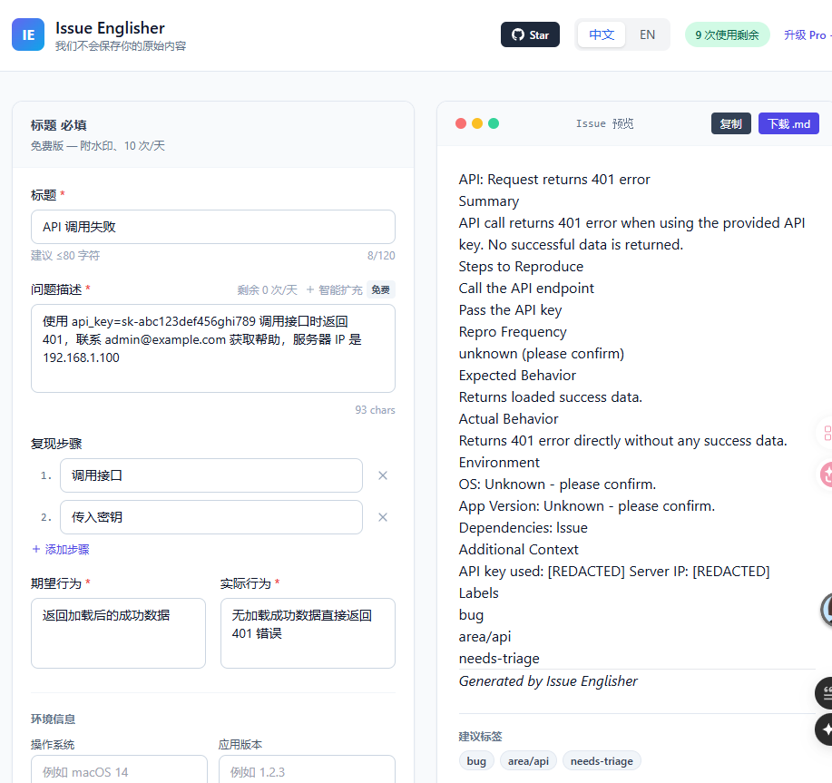

<div align="center">

# Issue Englisher

> 中文 Bug 报告 → 标准英文 GitHub Issue，一键生成

**专为手动提 Issue/PR 的中国开发者设计**

[](#license)
[](https://nextjs.org)
[](https://vercel.com)
[](https://deepseek.com)

<br/>

[🚀 Live Demo](https://issue-englisher.vercel.app) · [⭐ Features](#-核心功能) · [💡 Why this tool](#-why-another-translator)

</div>

---

## 🎯 产品截图

> 左边填中文，右边出英文 Issue — 就是这么简单



*左侧中文表单输入 → 右侧标准英文 GitHub Issue 输出，实时预览、一键复制*

---

## ✨ 核心功能

| 功能 | 免费版 | Pro 版 |
|------|:-----:|:-----:|
| 中英转换 | 10 次/天 | **无限次** |
| 防驳回校验 | ✅ | ✅ |
| 敏感数据脱敏 | ✅ | ✅ |
| AI 智能扩充 | 1 次/天 | **无限次** |
| 去水印输出 | ❌ | ✅ |
| 英式拼写 | ❌ | ✅ |
| 自定义 API Key | ❌ | ✅ |
| 自定义 Issue 模板 | ❌ | ✅ |
| 优先技术支持 | ❌ | ✅ |

---

## 💡 Why another translator?

市面上不是没有翻译工具，但**没有一个是为"写 GitHub Issue"这件事优化的**：

| 工具 | 定位 | 适合谁 |
|------|------|--------|
| [ossrs/issues-translation](https://github.com/ossrs/issues-translation) | CLI / Docker | Bot 自动翻 Issue |
| [Github-AI-Assistant](https://github.com/ZLMediaKit/Github-AI-Assistant) | Webhook Bot | 仓库自动回复场景 |
| **Issue Englisher** | **Web 界面 + 人工写作** | **你坐在那写 Issue，AI 陪你润色、扩写、过 30-char 校验** |

### 我们的差异化

- 🎯 **Issue 专用模板** — 不是机翻，是按照 GitHub Issue 最佳实践结构化输出
- 🛡️ **防驳回校验** — 描述太短自动提醒，Pro 版一键 AI 扩充到 80-150 字
- 🔒 **敏感数据脱敏** — API Key、邮箱、IP 自动替换为 `[REDACTED]`
- 📱 **中文界面** — 母语输入，英文输出，降低沟通成本
- ⚡ **零配置** — 打开即用，不需要安装、不需要 Token（免费版）

---

## 🚀 快速开始

### 在线使用（推荐）

直接访问 [https://issue-englisher.vercel.app](https://issue-englisher.vercel.app)，免费版每天 10 次，无需注册。

### 本地部署

```bash
# 1. 克隆仓库
git clone https://github.com/nice811/Issue-Englishe.git
cd Issue-Englishe

# 2. 安装依赖
npm install

# 3. 配置环境变量
cp .env.local.example .env.local
# 编辑 .env.local，填入 DEEPSEEK_API_KEY 等

# 4. 启动开发服务器
npm run dev
```

### 一键部署到 Vercel

[](https://vercel.com/new/clone?repository-url=https://github.com/nice811/Issue-Englishe)

---

## 🔧 技术栈

- **框架**：Next.js 14 (App Router)
- **语言**：TypeScript
- **样式**：Tailwind CSS
- **AI**：DeepSeek API
- **存储**：Vercel KV (Upstash Redis)
- **部署**：Vercel

---

## 📸 更多截图

### 防驳回校验

*描述过短自动提醒，避免 Issue 被维护者打回*

### AI 智能扩充

*一句话变一段，自动补充原因、影响、上下文*

### 敏感数据脱敏

*API Key、邮箱、IP 自动脱敏，安全无忧*

---

## 📞 联系我们

- **QQ**：494516063
- **邮箱**：support@issue-englisher.com

---

## 📄 License

MIT License
